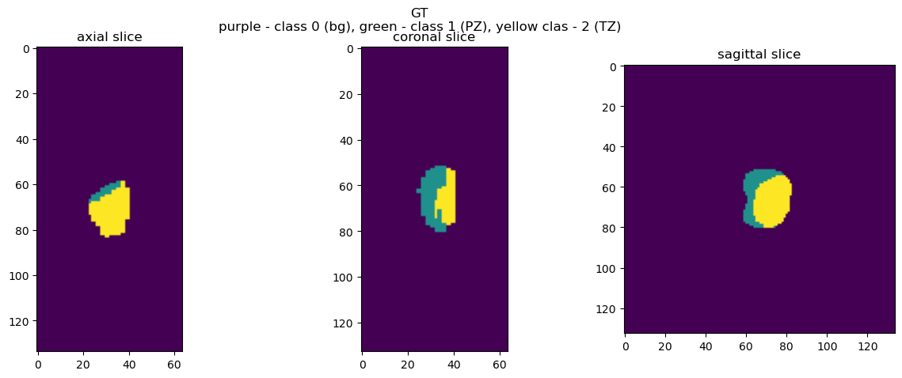
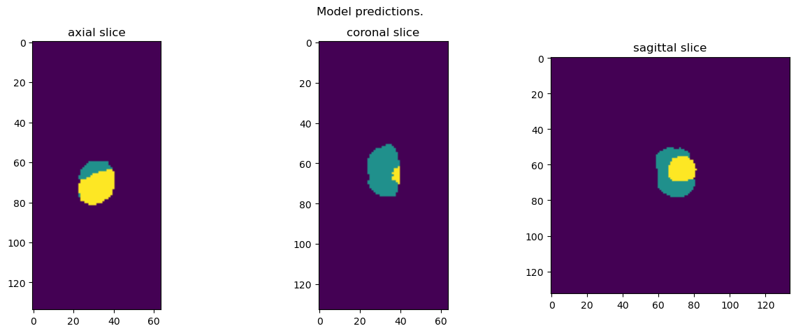
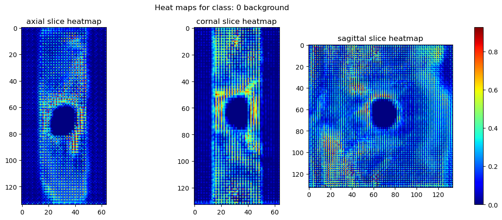
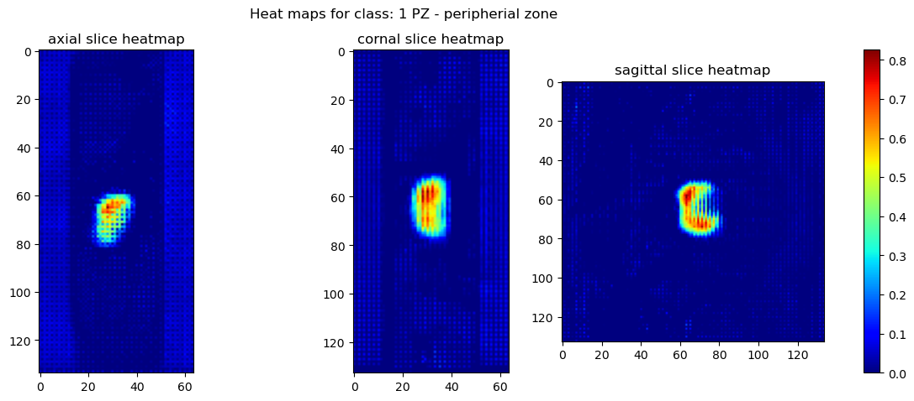
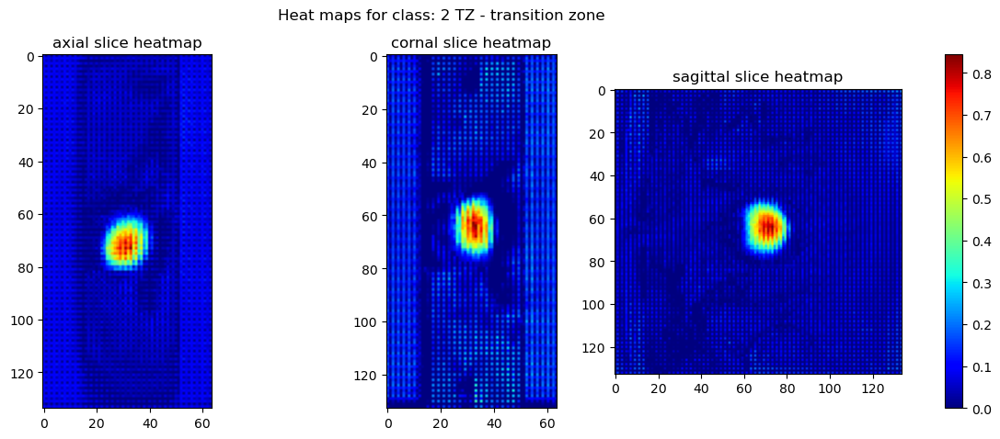
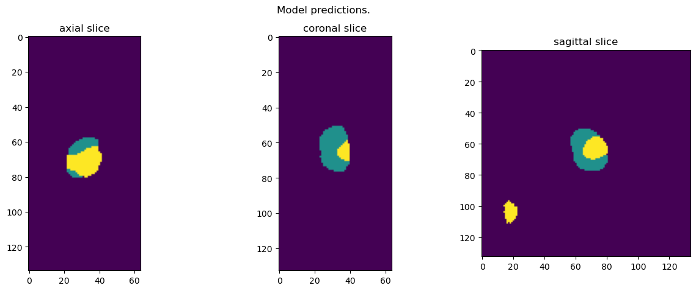
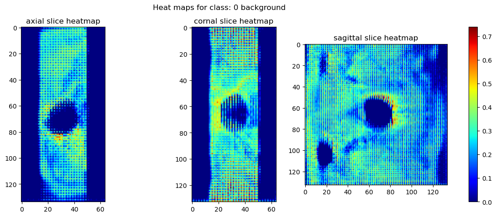
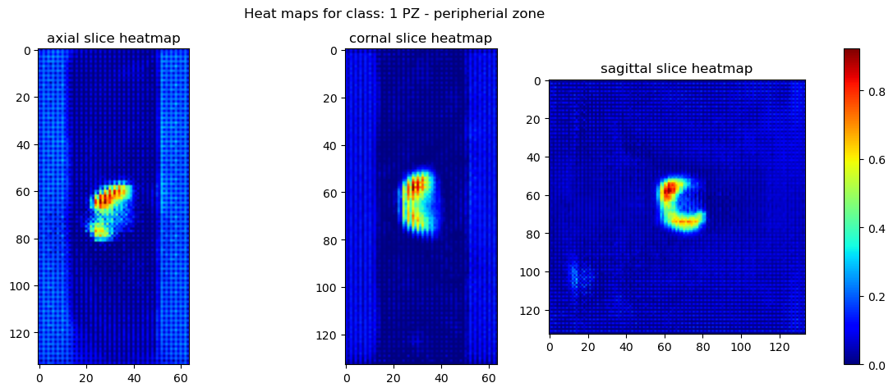
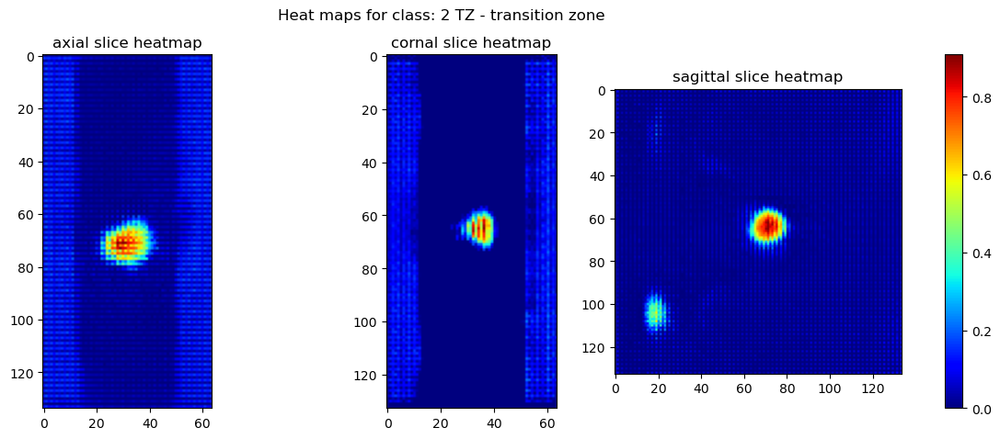

## 4 XAI 

Do analizy skuteczności i działania modelu zastosowano metody XAI (Explainable Artificial Intelligence). 
Celem jest uzyskanie wizualizacji, na jakich elementach skupia się sieć przy segmentacji do odpowiedniej kategorii. Pozwala to odnaleźć słabe strony sieci aby prowadzić dalszy rozwój modelu oraz pozwala określić jakie elementy sprawiają, że uzskane predykcje należy traktować mniej wiarygodnie co jest szczególnie istotne w braży medycznej. 

### 4.1. Grad-CAM 
Zastosowano technikę **Grad-CAM** *(Gradient-weighted Class Activation Map)* która umożliwia wizualizację decyzji modelu poprzez wygenerowanie mapy aktywacji *(heatmap)*.
Mapa ta wskazuje obszary na obrazie wejściowym które miały kluczowy wpływ na aktywację wybranej warstwy modelu. 

W przypadku zadania segmentacji istotna jest analiza ostatniej warstwy konwolucyjnej dekodera, która zawiera najwięcej informacji obiektach, ich cechach oraz kontekście, zachowując przy tym wysoką rozdzielczość przestrzenną, zbliżoną do obrazu wejściowego. 

Aby obliczyć mapę aktywacji dla konwolucji 3D, najpierw należy obliczyć wagę $\alpha_k$ dla poszczególnej ($k$) mapy cech z pośród wszystkich $n$ kanałów:

$$\alpha_k = \frac{1}{Z} 
\sum_{x} \sum_{y} \sum_{z}
\frac{\partial y^c}{\partial A_{xyz}^k}
$$
gdzie:  
$Z$ - liczba wszystkich wokseli na mapie,  
$y^c$ - logit dla danej klasy $c$ (przed funkcją aktywacji)  
$A_{xyz}^k$ - wartość woksela w przestrzeni $(x, y, z)$, dla cechy $k$ 

Jest to średnia wartość gradientu wyjścia względem wejścia. 
Dla każdej z $n$ cech w danej warstwie otrzymano wagę $\alpha_k$.

Następnie obliczana jest mapa aktywacji dla danej klasy $c$ $L_{grad}^c$ poprzez sumowanie wszystkich $n$ map cech przemnożonych przez odpowiednie wagi:

$$L_{Grad-CAM}^c = ReLU\left( \sum_{k} \alpha_k^c A^k_{xyz} \right)$$

Dla skuteczniejszej analizy, po obliczeniu map aktywacji, dla każdej z klas oraz dla każdej z płaszczyzn wybrano przekrój zawierający najsilniejszą aktywaję, aby skupić się na istotnych fragemntach danych.

### 4.2. Uzyskane wyniki dla modelu **VNet**. 
 
Przykładowy skad ze zbioru walidacyjnego, zawierający wszystkie 3 klasy:

Ground truth dla tego skanu:

Predykcja modelu dla tych danych:

#### 4.2.1. Klasa "0" - tło 

Widać większą aktywację w rejonach odpowiadającym kościom miednicy. Wnioskować można że model rozróżnia je i klasyfikuje jako tło, co jest porządanym działaniem. 
Obszary które niezawierają żadnych tkanek oraz obszary gdzie znajduje się prostata mają bardzo niską aktywację. 
Model poprawnie nauczył się rozróżniać tło od elementów prostaty. 

#### 4.2.2. Klasa "1" -  PZ *Peripherial Zone* - strefa obwodowa prostaty

#### 4.2.3. Klasa "2" - TZ *Transition Zone* - strefa przejściowa prostaty

### 4.3. Uzyskane wyniki dla modelu **AttentionVNet**. 
 
Przykładowy skad ze zbioru walidacyjnego, zawierający wszystkie 3 klasy:

Ground truth dla tego skanu:

Predykcja modelu dla tych danych:

#### 4.3.1. Klasa "0" - tło 

Widać większą aktywację w rejonach odpowiadającym kościom miednicy. Wnioskować można że model rozróżnia je i klasyfikuje jako tło, co jest porządanym działaniem. 
Obszary które niezawierają żadnych tkanek oraz obszary gdzie znajduje się prostata mają bardzo niską aktywację. 
Model poprawnie nauczył się rozróżniać tło od elementów prostaty. 

#### 4.3.2. Klasa "1" -  PZ *Peripherial Zone* - strefa obwodowa prostaty

#### 4.3.3. Klasa "2" - TZ *Transition Zone* - strefa przejściowa prostaty

